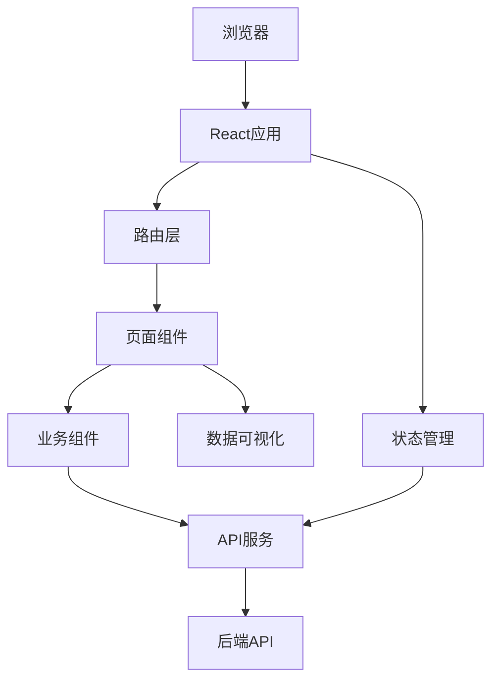
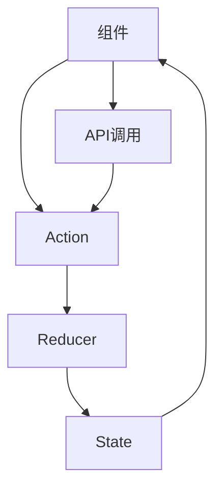
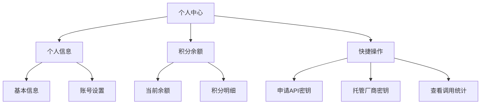
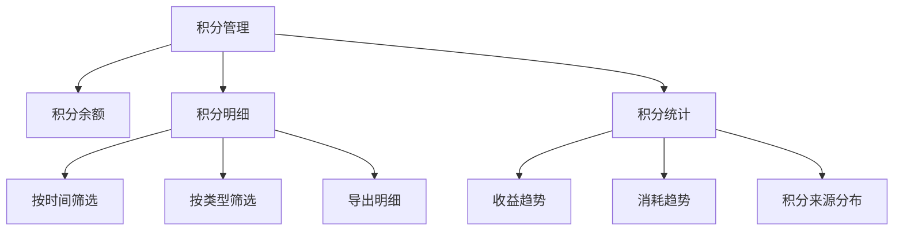
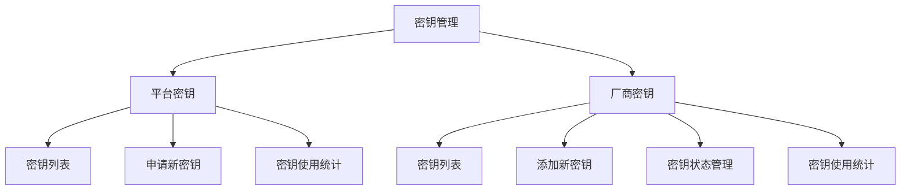
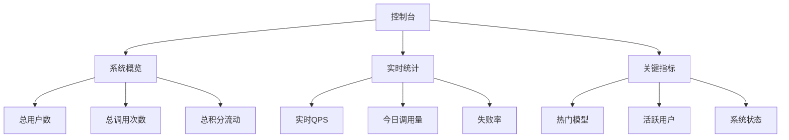
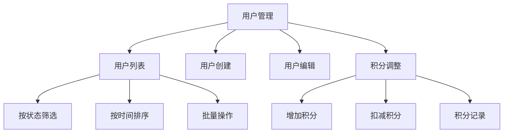
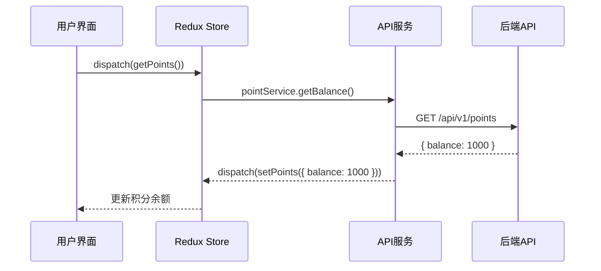
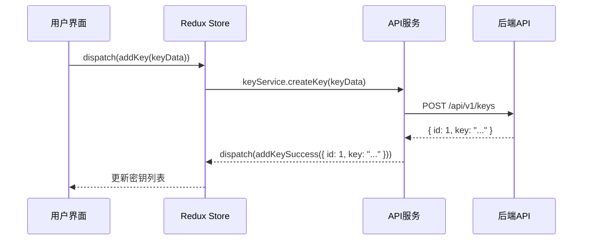
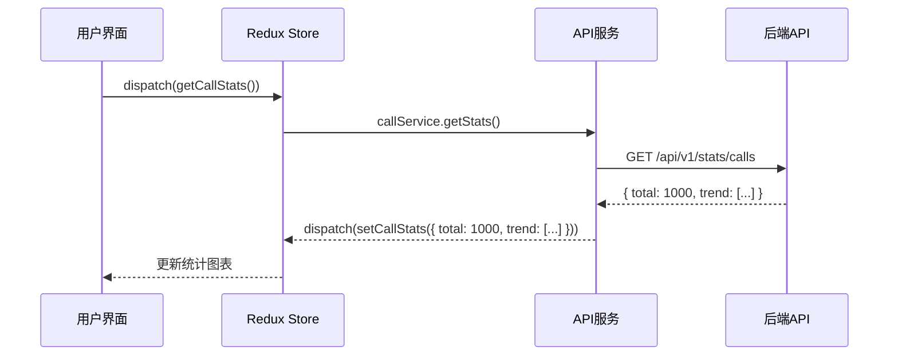

# LLM API聚合计费路由器前端技术方案

## 1. 技术栈选择

| 类别 | 技术 | 版本 | 选型理由 |
|------|------|------|----------|
| 框架 | React | 18.2.0 | 流行的前端框架，生态丰富，组件化开发 |
| 构建工具 | Vite | 5.0.8 | 快速的构建工具，支持热更新 |
| 状态管理 | Redux Toolkit | 2.0.1 | 可预测的状态管理，适合复杂应用 |
| UI组件库 | Ant Design | 5.12.8 | 丰富的组件，美观的设计，适合管理系统 |
| 路由 | React Router | 6.20.1 | 声明式路由，支持嵌套路由 |
| HTTP客户端 | Axios | 1.6.2 | 可靠的HTTP客户端，支持拦截器 |
| 数据可视化 | ECharts | 5.4.3 | 强大的数据可视化库，支持各种图表 |
| 表单处理 | Formik | 2.4.5 | 灵活的表单处理库，支持表单验证 |
| 认证 | JWT | - | 与后端认证机制保持一致 |

## 2. 系统架构设计

### 2.1 整体架构



### 2.2 核心模块划分

| 模块 | 职责 | 文件位置 |
|------|------|----------|
| src/pages | 页面组件 | src/pages/ |
| src/components | 业务组件 | src/components/ |
| src/services | API服务 | src/services/ |
| src/store | 状态管理 | src/store/ |
| src/utils | 工具函数 | src/utils/ |
| src/hooks | 自定义钩子 | src/hooks/ |
| src/types | 类型定义 | src/types/ |
| src/assets | 静态资源 | src/assets/ |

## 3. 页面设计

### 3.1 普通用户页面

#### 3.1.1 登录页面
- 账号密码登录
- 记住密码
- 忘记密码（可选）

#### 3.1.2 个人中心
- 个人信息展示
- 积分余额展示
- 快捷操作入口

#### 3.1.3 积分管理
- 积分余额明细
- 积分变动记录
- 按时间/类型筛选

#### 3.1.4 密钥管理
- 平台密钥列表
- 厂商密钥托管
- 密钥状态管理
- 密钥使用统计

#### 3.1.5 调用统计
- 调用次数趋势图
- 模型使用分布
- 失败率统计
- 详细调用日志

### 3.2 后端管理页面

#### 3.2.1 登录页面
- 管理员登录
- 验证码（可选）

#### 3.2.2 控制台
- 系统概览
- 实时调用统计
- 关键指标展示

#### 3.2.3 用户管理
- 用户列表
- 用户创建/编辑
- 用户状态管理
- 积分调整

#### 3.2.4 密钥管理
- 所有密钥列表
- 密钥状态管理
- 密钥使用情况
- 密钥批量操作

#### 3.2.5 模型管理
- 模型列表
- 模型创建/编辑
- 定价配置
- 厂商管理

#### 3.2.6 系统监控
- 调用日志
- 系统状态
- 异常告警
- 配置管理

## 4. 核心功能实现

### 4.1 认证与授权

- JWT令牌管理
- 登录状态持久化
- 路由权限控制
- API请求拦截器

### 4.2 积分管理

- 积分余额实时展示
- 积分变动记录查询
- 积分明细导出
- 积分统计图表

### 4.3 密钥管理

- 平台密钥申请
- 厂商密钥上传
- 密钥状态管理
- 密钥使用统计

### 4.4 调用统计

- 调用次数趋势分析
- 模型使用分布
- 失败率统计
- 详细调用日志查询

### 4.5 系统管理

- 用户管理
- 模型管理
- 密钥管理
- 系统监控

## 5. 数据流设计

### 5.1 状态管理



### 5.2 核心状态

| 状态 | 类型 | 用途 |
|------|------|------|
| user | Object | 当前用户信息 |
| tokens | Object | 认证令牌 |
| points | Object | 积分信息 |
| keys | Array | 密钥列表 |
| calls | Object | 调用统计 |
| users | Array | 用户列表（管理员） |
| models | Array | 模型列表（管理员） |
| system | Object | 系统状态（管理员） |

### 5.3 API服务

| 服务 | 功能 | 模块 |
|------|------|------|
| authService | 认证相关 | src/services/auth.ts |
| userService | 用户相关 | src/services/user.ts |
| pointService | 积分相关 | src/services/point.ts |
| keyService | 密钥相关 | src/services/key.ts |
| callService | 调用相关 | src/services/call.ts |
| adminService | 管理员相关 | src/services/admin.ts |

## 6. 响应式设计

- 桌面端优先设计
- 平板端适配
- 移动端基本功能支持
- 响应式布局使用媒体查询

## 7. 安全性考虑

- JWT令牌安全存储
- API请求加密
- 输入验证
- 防止XSS攻击
- 防止CSRF攻击

## 8. 性能优化

- 组件懒加载
- 代码分割
- 缓存策略
- 图片优化
- 减少HTTP请求

## 9. 部署方案

### 9.1 开发环境

- Vite开发服务器
- 热更新
- 代理配置

### 9.2 生产环境

- 静态文件构建
- CDN部署
- 缓存策略
- HTTPS配置

## 10. 代码结构

```
frontend/
├── public/
│   ├── favicon.ico
│   └── index.html
├── src/
│   ├── assets/
│   ├── components/
│   │   ├── common/
│   │   ├── layout/
│   │   ├── points/
│   │   ├── keys/
│   │   └── stats/
│   ├── hooks/
│   ├── pages/
│   │   ├── auth/
│   │   ├── user/
│   │   └── admin/
│   ├── services/
│   ├── store/
│   │   ├── slices/
│   │   └── index.ts
│   ├── types/
│   ├── utils/
│   ├── App.tsx
│   ├── main.tsx
│   └── routes.tsx
├── .env
├── .eslintrc.js
├── .prettierrc
├── index.html
├── package.json
├── tsconfig.json
├── tsconfig.node.json
└── vite.config.ts
```

## 11. 依赖项

```json
{
  "dependencies": {
    "react": "^18.2.0",
    "react-dom": "^18.2.0",
    "react-router-dom": "^6.20.1",
    "@reduxjs/toolkit": "^2.0.1",
    "react-redux": "^9.0.4",
    "antd": "^5.12.8",
    "axios": "^1.6.2",
    "echarts": "^5.4.3",
    "formik": "^2.4.5",
    "yup": "^1.3.3",
    "dayjs": "^1.11.10"
  },
  "devDependencies": {
    "@types/react": "^18.2.43",
    "@types/react-dom": "^18.2.17",
    "@vitejs/plugin-react": "^4.2.1",
    "typescript": "^5.2.2",
    "vite": "^5.0.8",
    "eslint": "^8.55.0",
    "eslint-plugin-react": "^7.33.2",
    "eslint-plugin-react-hooks": "^4.6.0",
    "eslint-plugin-react-refresh": "^0.4.5",
    "prettier": "^3.1.1"
  }
}
```

## 12. 关键页面设计

### 12.1 普通用户 - 个人中心



### 12.2 普通用户 - 积分管理



### 12.3 普通用户 - 密钥管理



### 12.4 后端管理 - 控制台



### 12.5 后端管理 - 用户管理



## 13. 数据流示例

### 13.1 积分查询流程



### 13.2 密钥管理流程



### 13.3 调用统计流程



## 14. 总结

本前端技术方案基于React和Ant Design，实现了一个功能完整、界面美观的LLM API聚合计费路由器前端应用。方案采用模块化设计，支持普通用户和管理员两种角色，提供了积分管理、密钥管理、调用统计等核心功能。通过Redux Toolkit进行状态管理，Axios处理API请求，ECharts实现数据可视化，确保了应用的性能和用户体验。

该方案满足了Demo期的需求，同时为后续的功能扩展和性能优化预留了空间。通过合理的代码结构和组件设计，确保了前端应用的可维护性和可扩展性。