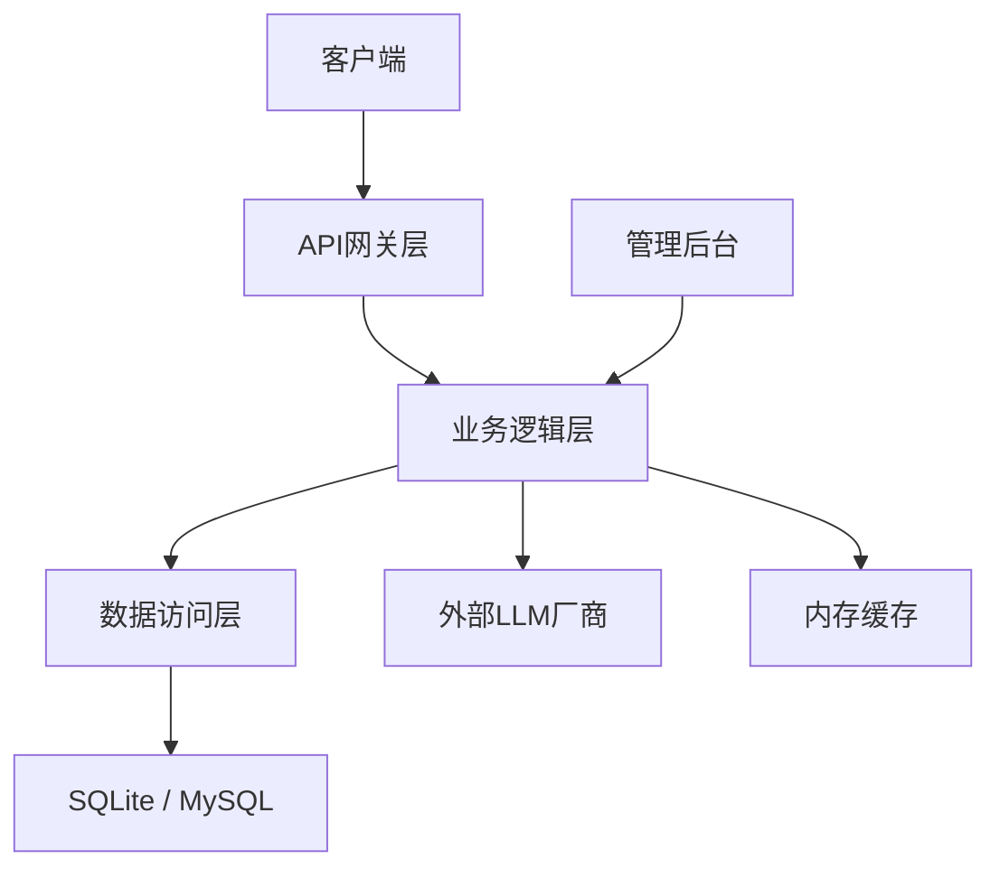
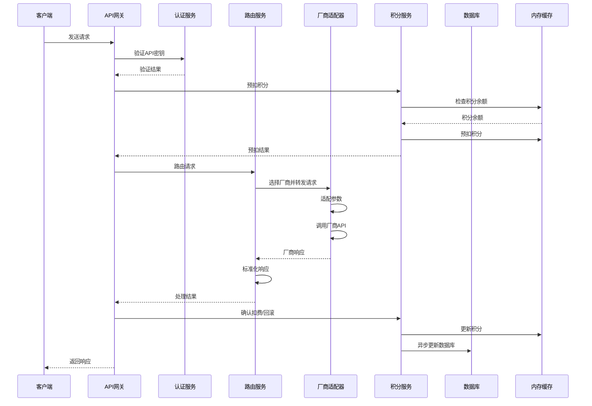
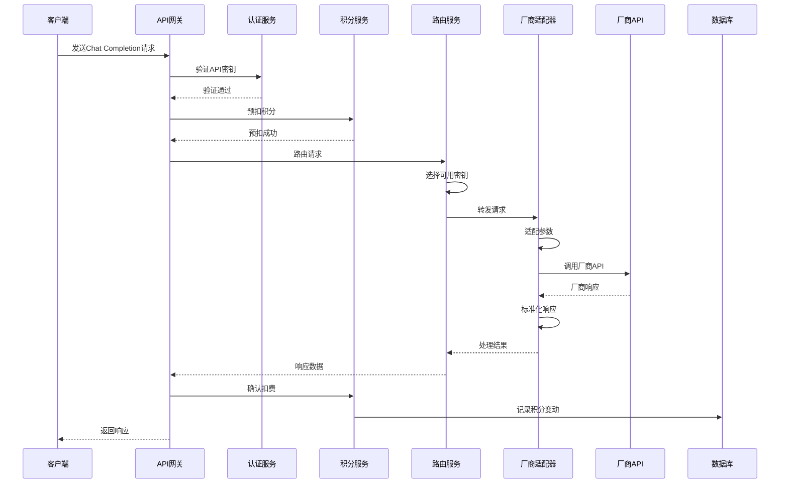
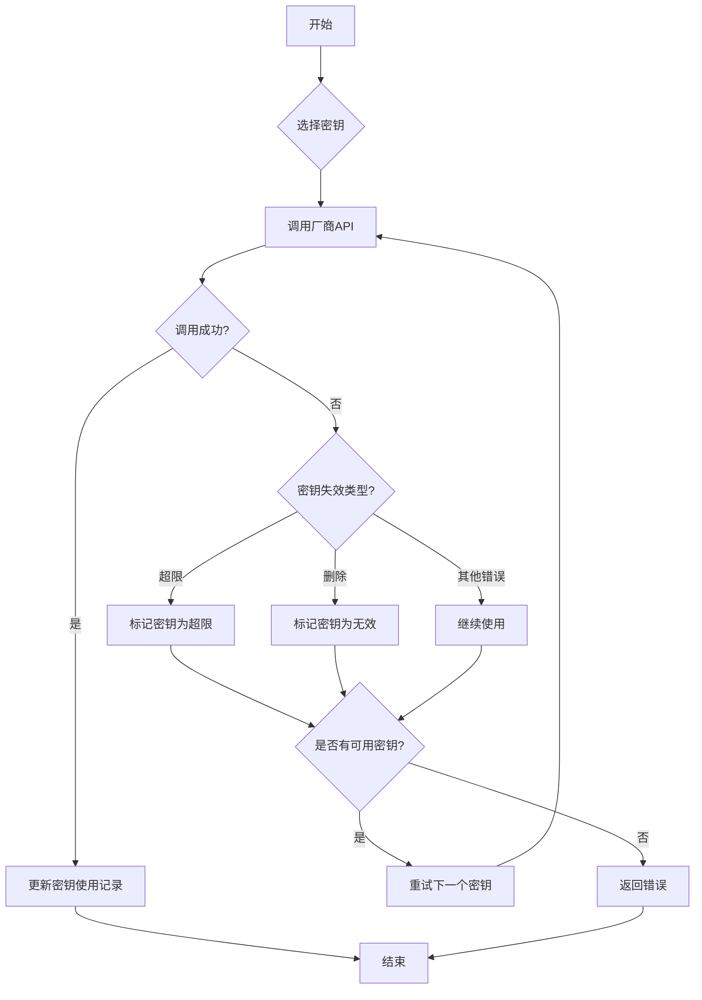
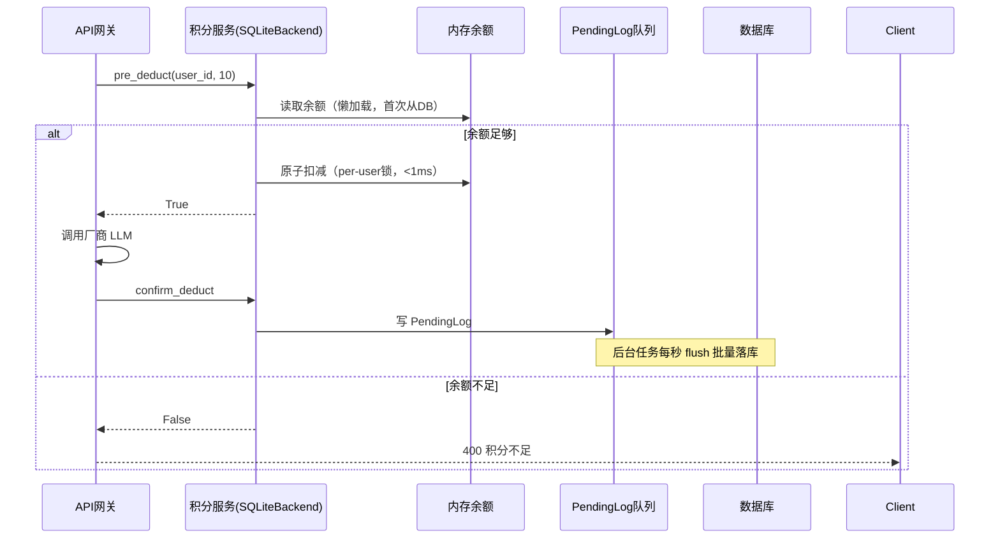
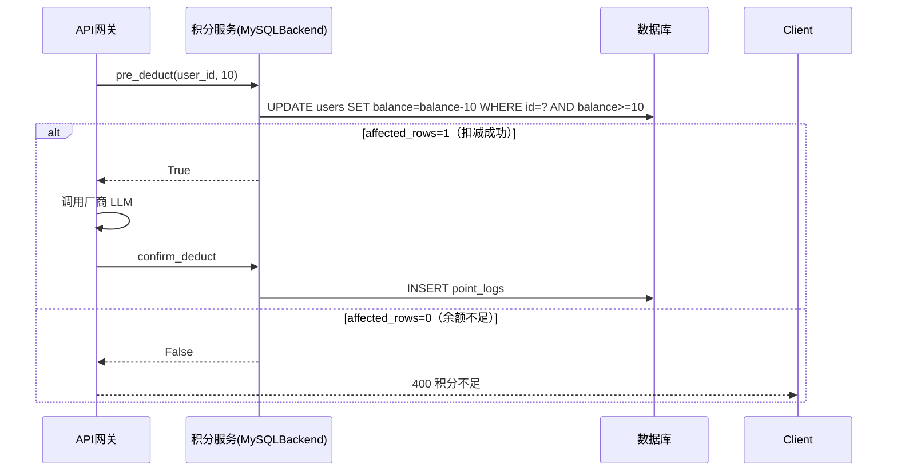

# LLM API聚合计费路由器技术方案

## 1. 技术栈选择

| 类别 | 技术 | 版本 | 选型理由 |
|------|------|------|----------|
| 后端语言 | Python | 3.7+ | 简单易用，生态丰富，适合快速开发API服务 |
| Web框架 | FastAPI | 0.104.1 | 高性能，自动生成API文档，支持异步处理 |
| 数据库 | SQLite / MySQL | 3.0+ / 8.0+ | 双驱动支持：SQLite 适合本地开发，MySQL 用于生产部署 |
| 缓存 | 内存缓存 | - | 轻量级，无需额外服务，适合Demo期使用 |
| 认证 | JWT | - | 无状态认证，便于水平扩展 |
| 加密 | cryptography | 41.0.7 | 提供简单的加密功能，用于密钥加密 |
| 测试 | pytest | 7.4.3 | 流行的Python测试框架，支持单元测试和集成测试 |

## 2. 系统架构设计

### 2.1 整体架构



### 2.2 核心模块划分

| 模块 | 职责 | 文件位置 |
|------|------|----------|
| api | API网关，处理HTTP请求 | app/api/ |
| services | 业务逻辑，处理核心功能 | app/services/ |
| models | 数据模型，定义数据库表结构 | app/models/ |
| schemas | 数据验证，定义请求和响应结构 | app/schemas/ |
| providers | 厂商适配器，处理不同厂商的API调用 | app/providers/ |
| utils | 工具函数，提供通用功能 | app/utils/ |
| config | 配置管理，处理系统配置 | app/config/ |
| tests | 测试代码，确保功能正常 | tests/ |

## 3. 核心功能实现

### 3.1 API网关模块

#### 3.1.1 路由设计

#### 3.1.0 模型命名约定与 provider 白名单

调用模型时，`model` 字段格式为 `provider/真实模型名`，例如：

- `modelscope/moonshotai/Kimi-K2.5` → 通过 ModelScope 接口调用 `moonshotai/Kimi-K2.5`
- `zhipu/glm-4` → 通过智谱接口调用 `glm-4`

后端从 `model` 第一段提取 `provider`，从剩余部分提取真实模型名，在 `PROVIDER_BASE_URLS` 白名单中查找对应 `base_url`。

**安全策略（SSRF 防护）**：创建厂商密钥时，`provider` 必须在以下白名单内，否则 400 拒绝：

| provider | base_url |
|----------|----------|
| modelscope | https://api-inference.modelscope.cn/v1 |
| zhipu | https://open.bigmodel.cn/api/paas/v4 |
| minimax | https://api.minimax.chat/v1 |
| alibaba | https://dashscope.aliyuncs.com/compatible-mode/v1 |
| tencent | https://api.hunyuan.cloud.tencent.com/v1 |
| baidu | https://qianfan.baidubce.com/v2 |
| deepseek | https://api.deepseek.com/v1 |
| siliconflow | https://api.siliconflow.cn/v1 |

所有厂商均使用 OpenAI 兼容格式（`ModelScopeProvider`），无需单独适配器。

##### 3.1.1.1 普通用户接口

| 路径 | 方法 | 功能 | 模块 |
|------|------|------|------|
| /api/v1/auth/login | POST | 用户登录 | api/auth.py |
| /api/v1/users/me | GET | 获取个人信息 | api/users.py |
| /api/v1/keys | POST | 创建API密钥 | api/keys.py |
| /api/v1/keys | GET | 获取密钥列表 | api/keys.py |
| /api/v1/keys/{key_id} | PUT | 更新密钥状态 | api/keys.py |
| /api/v1/keys/{key_id} | DELETE | 删除密钥 | api/keys.py |
| /api/v1/points | GET | 获取积分余额 | api/points.py |
| /api/v1/points/logs | GET | 获取积分明细（query: limit/offset） | api/points.py |
| /api/v1/chat/completions | POST | 聊天完成接口 | api/chat.py |
| /api/v1/embeddings | POST | 嵌入接口 | api/embeddings.py |

##### 3.1.1.2 后端管理接口

> **注意**：管理员接口前缀为 `/api/admin`（非 `/admin`），避免与前端路由冲突。管理员登录在用户认证模块中。

| 路径 | 方法 | 功能 | 模块 |
|------|------|------|------|
| /api/v1/auth/admin/login | POST | 管理员登录 | api/auth.py |
| /api/admin/users | GET | 管理用户列表 | api/admin.py |
| /api/admin/users | POST | 创建用户 | api/admin.py |
| /api/admin/users/{user_id} | PUT | 更新用户状态（query: status） | api/admin.py |
| /api/admin/users/{user_id} | DELETE | 禁用用户（status→0） | api/admin.py |
| /api/admin/points | POST | 调整用户积分 | api/admin.py |
| /api/admin/keys | GET | 查看所有密钥 | api/admin.py |
| /api/admin/keys/{key_id} | PUT | 管理密钥状态（query: status） | api/admin.py |
| /api/admin/keys/{key_id} | DELETE | 删除密钥（status→1） | api/admin.py |
| /api/admin/logs | GET | 查看调用日志（query: limit/offset） | api/admin.py |

> **未实现**：`/admin/models`（模型管理）、`/admin/system`（系统状态）在当前版本中尚未实现。

#### 3.1.2 请求处理流程



### 3.2 业务逻辑模块

#### 3.2.1 认证服务

- 实现JWT令牌生成和验证
- 处理用户登录认证
- 验证API密钥有效性

#### 3.2.2 积分服务

采用**策略模式（Strategy Pattern）**，根据数据库 driver 自动切换后端实现：

| 模式 | driver | 实现方式 |
|------|--------|---------|
| SQLiteBackend | sqlite | 内存余额 + per-user 锁 + 异步 flush 落库 |
| MySQLBackend | mysql | 直接写 DB，利用 MySQL 行锁保证并发安全 |

- **SQLiteBackend**：启动时懒加载用户余额到内存，`pre_deduct` 纯内存原子扣减（持锁 < 1ms），积分变动写入 `PendingLog` 队列，后台任务每秒批量 flush 落库
- **MySQLBackend**：`pre_deduct` 通过 `UPDATE ... WHERE balance >= amount` 原子扣减，`rowcount=0` 即余额不足，AI 响应本身耗时数秒，DB 写入毫秒级，无需缓存层；`flush_to_db()` 为空操作
- **计费单价**：当前固定 **10 积分/次**，每次成功调用扣减，失败自动回滚
- 对外统一暴露 `PointsService`，调用方零感知 driver 切换

#### 3.2.3 密钥管理服务

- 生成和管理平台API密钥
- 处理厂商密钥的加密存储和管理
- 实现密钥状态管理和监控

#### 3.2.4 路由服务

- 根据模型参数选择合适的厂商
- 实现轮询策略选择可用密钥
- 处理密钥失效和自动重试

#### 3.2.5 厂商适配服务

- 实现不同厂商API的参数适配
- 处理厂商响应的标准化
- 支持流式响应

### 3.3 数据访问模块

- 实现数据库表结构
- 提供数据CRUD操作
- 实现缓存机制，提高性能

## 4. 数据库设计

### 4.1 表结构

#### 4.1.1 `users` 用户表

| 字段 | 类型 | 说明 |
|------|------|------|
| id | INTEGER | 主键，自增 |
| username | TEXT | 用户名，唯一 |
| email | TEXT | 邮箱，唯一 |
| password_hash | TEXT | 密码哈希 |
| balance | INTEGER | 积分余额，单位：分 |
| status | INTEGER | 状态：0 - 禁用，1 - 正常 |
| created_at | INTEGER | 创建时间戳 |

#### 4.1.2 `api_keys` 密钥表

| 字段 | 类型 | 说明 |
|------|------|------|
| id | INTEGER | 主键，自增 |
| user_id | INTEGER | 所属用户 ID，外键关联 users.id |
| key_type | INTEGER | 密钥类型：1 - 平台调用密钥，2 - 用户托管的厂商密钥 |
| provider | TEXT | 厂商类型（仅厂商密钥有效）：minimax, zhipu, alibaba, tencent, baidu 等 |
| encrypted_key | TEXT | 加密后的密钥内容（平台密钥存明文，厂商密钥加密存储） |
| name | TEXT | 密钥名称 |
| status | INTEGER | 状态：0 - 正常，1 - 删除，2 - 禁用，3 - 超限冷却，4 - 无效 |
| cooldown_until | DATETIME | 冷却截止时间（status=3 超限冷却时使用，到期自动恢复） |
| used_count | INTEGER | 累计调用次数 |
| last_used_at | INTEGER | 最后使用时间戳 |
| created_at | INTEGER | 创建时间戳 |

#### 4.1.3 `point_logs` 积分明细表

| 字段 | 类型 | 说明 |
|------|------|------|
| id | INTEGER | 主键，自增 |
| user_id | INTEGER | 所属用户 ID |
| amount | INTEGER | 变动数量，正数为增加，负数为扣减 |
| type | INTEGER | 变动类型：1 - 调用消耗，2 - 托管收益，3 - 管理员调整 |
| related_key_id | INTEGER | 关联的密钥 ID |
| model | TEXT | 关联的模型 |
| remark | TEXT | 备注 |
| created_at | INTEGER | 时间戳 |

#### 4.1.4 `call_logs` 调用日志表

| 字段 | 类型 | 说明 |
|------|------|------|
| id | INTEGER | 主键，自增 |
| user_id | INTEGER | 调用用户 ID |
| provider_key_id | INTEGER | 本次使用的厂商密钥 ID |
| model | TEXT | 模型名称 |
| status | INTEGER | 调用状态：0 - 失败，1 - 成功 |
| error_msg | TEXT | 错误信息（失败时） |
| ip | TEXT | 调用者 IP |
| created_at | INTEGER | 时间戳 |

#### 4.1.5 `system_config` 系统配置表

| 字段 | 类型 | 说明 |
|------|------|------|
| key | TEXT | 配置键，主键 |
| value | TEXT | 配置值 |

### 4.2 缓存设计

系统使用进程内 `MemoryCache`（分段锁实现），当前仅用于密钥路由层：

| 缓存键 | 类型 | 过期时间 | 用途 |
|--------|------|----------|------|
| `available_keys:{provider}` | List | 5分钟 | 缓存可用厂商密钥列表，减少路由时的 DB 查询 |
| `api_key:{key}` | String | 1小时 | 缓存平台密钥 → 用户 ID 的映射，加速认证 |

> **积分余额缓存**：仅在 SQLite 模式（`_SQLiteBackend`）下存在，以进程内 `dict` 实现，不使用 `MemoryCache`；MySQL 模式直接读写 DB，无余额缓存。

## 5. 部署与配置

### 5.1 环境要求

- Python 3.11+
- SQLite 3.0+（本地开发）或 MySQL 8.0+（生产部署）
- PyMySQL（使用 MySQL 时需要）

### 5.2 安装步骤

1. 克隆代码仓库
2. 安装依赖：`pip install -r requirements.txt`
3. 配置环境变量（见 5.4 节）
4. 初始化数据库：`python init_db.py`
5. 启动服务：`uvicorn app.main:app --host 0.0.0.0 --port 3000`

### 5.3 配置文件（config.yaml）

`config.yaml` 只存放**非敏感配置**，可以提交到 Git。密码、密钥等敏感信息通过环境变量注入（格式：`${ENV_VAR_NAME}`），启动时自动展开。

#### SQLite 模式（本地开发）

```yaml
database:
  driver: "sqlite"
  path: "./data/app.db"
```

#### MySQL 模式（生产推荐）

```yaml
database:
  driver: "mysql"
  host: "your-mysql-host"
  port: 3306
  user: "${DB_USER}"        # 从环境变量读取
  password: "${DB_PASSWORD}" # 从环境变量读取
  name: "your_database_name"
  pool_size: 20             # 连接池大小（生产建议 10~20）
  max_overflow: 40          # 超出 pool_size 时最多额外创建的连接数
  pool_recycle: 1800        # 连接空闲超过此秒数后自动重建（防 MySQL 8h 断连）
```

#### 完整 config.yaml 示例

```yaml
# 管理员配置
admin:
  password: "admin123"

# 数据库配置（见上方 SQLite / MySQL 两种模式）
database:
  driver: "mysql"
  host: "your-mysql-host"
  port: 3306
  user: "${DB_USER}"
  password: "${DB_PASSWORD}"
  name: "coding_plan_share"
  pool_size: 20
  max_overflow: 40
  pool_recycle: 1800

# 限流配置
rate_limit:
  user_rpm: 60
  default_provider_rpm: 30

# 加密配置（值从环境变量读取）
security:
  encryption_key: "${ENCRYPTION_KEY}"
  jwt_secret: "${JWT_SECRET}"

# 超时配置
timeout:
  request_timeout: 5

# 密钥管理配置
key_management:
  max_retry: 1
  cool_down_period: 7200

# 日志配置
logging:
  level: "INFO"
  format: "%(asctime)s - %(name)s - %(levelname)s - %(message)s"
```

### 5.4 环境变量配置

敏感信息**不写入 config.yaml**，通过环境变量或 `.env` 文件注入。`.env` 已加入 `.gitignore`，不会提交到代码仓库。

#### 方式一：`.env` 文件（本地开发推荐）

```bash
# 复制模板
cp .env.example .env
# 编辑填入真实值
```

`.env` 文件内容：

```bash
# 数据库
DB_USER=your_db_user
DB_PASSWORD=your_db_password

# 安全
ENCRYPTION_KEY=your-32-char-fernet-key   # 加密厂商密钥用
JWT_SECRET=your-jwt-secret-key           # 登录 token 签名用
```

#### 方式二：系统环境变量（生产/容器部署推荐）

```bash
# Linux / Docker ENV / K8s Secret
export DB_USER=your_db_user
export DB_PASSWORD=your_db_password
export ENCRYPTION_KEY=your-encryption-key
export JWT_SECRET=your-jwt-secret
```

> **优先级**：系统环境变量 > `.env` 文件 > config.yaml 占位符默认值

#### 环境变量一览

| 变量名 | 说明 | 是否必填 |
|--------|------|----------|
| `DB_USER` | 数据库用户名（MySQL 模式必填） | MySQL 必填 |
| `DB_PASSWORD` | 数据库密码（MySQL 模式必填） | MySQL 必填 |
| `ENCRYPTION_KEY` | 厂商密钥加密主密钥（Fernet） | 必填 |
| `JWT_SECRET` | JWT 签名密钥 | 必填 |

## 6. API 接口文档

> 所有接口均以 JSON 格式收发数据。时间戳字段均为 Unix 秒级整数。
> 认证方式：用户端接口在 Header 中携带 `Authorization: Bearer <user_token>`；
> 管理员接口在 Header 中携带 `Authorization: Bearer <admin_token>`；
> 对话接口（`/api/v1/chat`）使用 `api-key: <platform_key>` Header。

---

### 6.1 认证接口

#### POST `/api/v1/auth/login` — 用户登录

**请求体**

| 字段 | 类型 | 必填 | 说明 |
|------|------|------|------|
| email | string | ✅ | 用户邮箱 |
| password | string | ✅ | 用户密码 |

**响应体**

| 字段 | 类型 | 说明 |
|------|------|------|
| access_token | string | JWT，后续请求放入 `Authorization: Bearer` header |
| token_type | string | 固定值 `"bearer"` |
| user_id | int | 用户 ID |
| username | string | 用户名 |

---

#### POST `/api/v1/auth/admin/login` — 管理员登录

**请求体**

| 字段 | 类型 | 必填 | 说明 |
|------|------|------|------|
| password | string | ✅ | 管理员密码（见 `config.yaml` 中 `admin.password`） |

**响应体**

| 字段 | 类型 | 说明 |
|------|------|------|
| access_token | string | 管理员 JWT，后续管理接口放入 `Authorization: Bearer` header |
| token_type | string | 固定值 `"bearer"` |

---

### 6.2 用户接口（需要用户 JWT）

#### GET `/api/v1/users/me` — 获取当前用户信息

**响应体**

| 字段 | 类型 | 说明 |
|------|------|------|
| id | int | 用户 ID |
| username | string | 用户名 |
| email | string | 邮箱 |
| balance | int | 积分余额（单位：分） |
| status | int | 用户状态，见[用户状态枚举](#用户状态枚举) |
| created_at | int | 注册时间戳（Unix 秒） |

---

### 6.3 密钥接口（需要用户 JWT）

#### GET `/api/v1/keys` — 获取密钥列表

**响应体**（数组，每项字段如下）

| 字段 | 类型 | 说明 |
|------|------|------|
| id | int | 密钥 ID |
| user_id | int | 所属用户 ID |
| key_type | int | 密钥类型，见[密钥类型枚举](#密钥类型枚举) |
| provider | string \| null | 厂商标识（仅厂商密钥有值），见[厂商枚举](#厂商枚举) |
| name | string | 密钥名称（用户自定义） |
| status | int | 密钥状态，见[密钥状态枚举](#密钥状态枚举) |
| used_count | int | 累计被调用次数 |
| last_used_at | int \| null | 最后使用时间戳（Unix 秒），未使用过则为 null |
| created_at | int | 创建时间戳（Unix 秒） |
| encrypted_key | string | 平台密钥：明文 key 值；厂商密钥：加密后的密文 |

---

#### POST `/api/v1/keys` — 创建密钥

**请求体**

| 字段 | 类型 | 必填 | 说明 |
|------|------|------|------|
| name | string | ✅ | 密钥名称 |
| key_type | int | ✅ | `1`=平台调用密钥，`2`=厂商托管密钥 |
| provider | string | 厂商密钥必填 | 厂商标识，见[厂商枚举](#厂商枚举)，须在白名单内 |
| encrypted_key | string | 厂商密钥必填 | 厂商原始 API Key，服务端加密存储 |

> 安全：`provider` 须在系统白名单（`PROVIDER_BASE_URLS`）内，否则返回 400，防止 SSRF。

---

#### PUT `/api/v1/keys/{key_id}` — 更新密钥

**请求体**（字段均可选）

| 字段 | 类型 | 说明 |
|------|------|------|
| name | string | 新名称 |
| status | int | 新状态，见[密钥状态枚举](#密钥状态枚举) |

---

#### DELETE `/api/v1/keys/{key_id}` — 删除密钥

软删除，将密钥 `status` 置为 `1`（已删除）。无请求体，响应 `{"message": "密钥已删除"}`。

---

### 6.4 积分接口（需要用户 JWT）

#### GET `/api/v1/points` — 获取积分余额

**响应体**

| 字段 | 类型 | 说明 |
|------|------|------|
| balance | int | 当前积分余额（单位：分） |

---

#### GET `/api/v1/points/logs` — 获取积分明细

**Query 参数**

| 参数 | 类型 | 默认值 | 说明 |
|------|------|--------|------|
| limit | int | 100 | 返回条数上限 |
| offset | int | 0 | 分页偏移量 |

**响应体**（数组，每项字段如下）

| 字段 | 类型 | 说明 |
|------|------|------|
| id | int | 记录 ID |
| user_id | int | 用户 ID |
| amount | int | 变动量（正数=增加，负数=扣减） |
| type | int | 变动类型，见[积分变动类型枚举](#积分变动类型枚举) |
| related_key_id | int \| null | 关联密钥 ID |
| model | string \| null | 关联模型名称 |
| remark | string \| null | 备注 |
| created_at | int | 时间戳（Unix 秒） |

---

### 6.5 对话接口

#### POST `/api/v1/chat/completions` — 聊天完成

> ⚠️ 此接口使用 `api-key: <平台密钥>` Header 认证，**不使用** JWT。
> 密钥所属用户须处于正常状态（`status=1`），否则返回 401。

**请求体**（OpenAI Chat Completions 兼容格式）

| 字段 | 类型 | 必填 | 说明 |
|------|------|------|------|
| model | string | ✅ | 模型名称，格式 `provider/真实模型名`，例如 `modelscope/moonshotai/Kimi-K2.5`、`mock/test` |
| messages | array | ✅ | 消息列表，每项包含 `role`（`user`/`assistant`/`system`）和 `content`（string） |
| temperature | float | | 采样温度，默认 `0.7` |
| max_tokens | int | | 最大生成 token 数，默认 `1000` |
| top_p | float | | nucleus sampling，默认 `1.0` |
| frequency_penalty | float | | 频率惩罚，默认 `0.0` |
| presence_penalty | float | | 存在惩罚，默认 `0.0` |

**响应体**（OpenAI Chat Completions 兼容格式）

| 字段 | 类型 | 说明 |
|------|------|------|
| id | string | 本次响应唯一 ID |
| object | string | 固定值 `"chat.completion"` |
| created | int | 创建时间戳（Unix 秒） |
| model | string | 实际使用的模型名 |
| choices | array | 结果列表，每项包含 `index`、`message`（含 `role` 和 `content`）、`finish_reason` |
| usage | object | token 用量：`prompt_tokens`、`completion_tokens`、`total_tokens` |

---

### 6.6 管理员接口（需要管理员 JWT）

#### GET `/api/admin/users` — 用户列表

响应体同 `/api/v1/users/me`，返回所有用户数组。

---

#### POST `/api/admin/users` — 创建用户

**请求体**

| 字段 | 类型 | 必填 | 说明 |
|------|------|------|------|
| username | string | ✅ | 用户名（唯一） |
| email | string | ✅ | 邮箱（唯一） |
| password | string | ✅ | 初始密码 |

---

#### PUT `/api/admin/users/{user_id}` — 更新用户状态

**Query 参数**

| 参数 | 类型 | 说明 |
|------|------|------|
| status | int | `0`=禁用，`1`=正常。禁用后该用户所有平台密钥立即失效（API 调用返回 401） |

---

#### POST `/api/admin/points` — 调整用户积分

**请求体**

| 字段 | 类型 | 必填 | 说明 |
|------|------|------|------|
| user_id | int | ✅ | 目标用户 ID |
| amount | int | ✅ | 调整量（正数=增加，负数=扣减） |
| remark | string | | 调整原因备注 |

---

#### GET `/api/admin/keys` — 所有密钥列表

响应体同用户密钥列表，返回所有用户的密钥数组（已删除的已过滤）。

---

#### PUT `/api/admin/keys/{key_id}` — 更新密钥状态

**Query 参数**

| 参数 | 类型 | 说明 |
|------|------|------|
| status | int | 见[密钥状态枚举](#密钥状态枚举) |

---

#### DELETE `/api/admin/keys/{key_id}` — 删除密钥

软删除，将 `status` 置为 `1`。

---

#### GET `/api/admin/logs` — 调用日志

**Query 参数**

| 参数 | 类型 | 默认值 | 说明 |
|------|------|--------|------|
| limit | int | 100 | 返回条数上限 |
| offset | int | 0 | 分页偏移量 |

**响应体**（数组，每项字段如下）

| 字段 | 类型 | 说明 |
|------|------|------|
| id | int | 日志 ID |
| user_id | int | 调用用户 ID |
| provider_key_id | int \| null | 实际使用的厂商密钥 ID |
| model | string \| null | 调用的模型名（含 provider 前缀） |
| status | int | `0`=失败，`1`=成功 |
| error_msg | string \| null | 错误信息（失败时） |
| ip | string \| null | 调用方 IP |
| created_at | int | 时间戳（Unix 秒） |

---

### 6.7 枚举值说明

#### 用户状态枚举

| 值 | 含义 | 影响 |
|----|------|------|
| 0 | 已禁用 | 该用户无法登录；其名下所有平台密钥调用返回 401 |
| 1 | 正常 | 正常使用 |

#### 密钥类型枚举

| 值 | 含义 | 说明 |
|----|------|------|
| 1 | 平台调用密钥 | 用于调用本平台对话接口（`api-key` header）；由系统自动生成 |
| 2 | 厂商托管密钥 | 用户将自己的厂商 API Key 托管到平台；由用户提供原始 key，服务端加密存储 |

#### 密钥状态枚举

| 值 | 含义 | 对调用的影响 |
|----|------|-------------|
| 0 | 正常 | 可被路由选中；若 `cooldown_until` 非 null 且未过期则处于超限冷却中，暂不可用，过期后懒恢复 |
| 1 | 已删除 | 不会被选中；列表接口过滤此状态 |
| 2 | 已禁用 | 不会被选中；可由管理员恢复 |
| 4 | 无效 | 厂商返回认证失败（401/403）时自动标记；需用户更换 key |

> **超限冷却**不单独占用一个 status 值。冷却状态由 `status=0` + `cooldown_until`（非 null）共同表达，冷却到期后系统在下次路由时懒恢复（清除 `cooldown_until`），无需定时任务。

#### 积分变动类型枚举

| 值 | 含义 | 触发场景 |
|----|------|---------|
| 1 | 调用消耗 | 用户使用平台密钥调用对话接口，固定扣减 **10 积分/次**，失败自动回滚 |
| 2 | 托管收益 | 用户的厂商密钥被平台调用，自动获得积分奖励 |
| 3 | 管理员调整 | 管理员手动通过 `/api/admin/points` 增减积分 |

#### 厂商枚举（provider 白名单）

| provider 值 | 厂商 | 对应 base_url | mock 可用 |
|-------------|------|---------------|-----------|
| `modelscope` | 魔搭社区 | `https://api-inference.modelscope.cn/v1` | ❌ |
| `zhipu` | 智谱 AI | `https://open.bigmodel.cn/api/paas/v4` | ❌ |
| `minimax` | MiniMax | `https://api.minimax.chat/v1` | ❌ |
| `alibaba` | 阿里云百炼 | `https://dashscope.aliyuncs.com/compatible-mode/v1` | ❌ |
| `tencent` | 腾讯混元 | `https://api.hunyuan.cloud.tencent.com/v1` | ❌ |
| `baidu` | 百度千帆 | `https://qianfan.baidubce.com/v2` | ❌ |
| `deepseek` | DeepSeek | `https://api.deepseek.com/v1` | ❌ |
| `siliconflow` | SiliconFlow | `https://api.siliconflow.cn/v1` | ❌ |
| `mock` | Mock（测试用）| 不发起真实请求 | ✅ |

> `mock` provider 的 `encrypted_key` 格式控制行为：
> - `mock` → 正常响应
> - `mock:slow` → 延迟 2 秒响应
> - `mock:fail` → 总是返回错误
> - `mock:fail_rate=0.3` → 30% 概率失败

---

## 7. 关键流程设计

### 6.1 模型调用流程



### 6.2 密钥失效处理流程



### 6.3 积分更新流程

积分服务采用策略模式，两种 driver 下流程不同：

**SQLite 模式（内存缓存 + 异步 flush）**



**MySQL 模式（直写 DB）**



## 8. 性能优化策略

1. **积分双后端策略**：
   - SQLite 模式：内存余额 + per-user 锁 + 后台异步 flush，持锁时间 < 1ms，避免文件锁竞争
   - MySQL 模式：行级 `UPDATE ... WHERE balance >= amount` 原子操作，直接写 DB，AI 响应数秒期间 DB 毫秒级写入不是瓶颈
2. **密钥缓存**：可用厂商密钥列表缓存 5 分钟，认证密钥缓存 1 小时，减少路由热路径 DB 查询
3. **连接池**：MySQL 模式配置连接池（默认 pool_size=10，max_overflow=20，pool_recycle=1800s 防 8h 断连）
4. **异步处理**：FastAPI 全链路异步，厂商 HTTP 调用使用 `httpx` 异步客户端，不阻塞事件循环
5. **密钥选择随机化**：从可用密钥中随机选取，避免单 key 热点，均摊调用压力

## 9. 安全措施

1. **密钥加密**：厂商API密钥使用加密存储，防止明文泄露
2. **密码哈希**：用户密码使用pbkdf2_sha256哈希存储，不可反向解密
3. **JWT认证**：使用JWT进行API认证，确保接口安全
4. **输入验证**：对所有用户输入进行严格验证，防止注入攻击
5. **日志审计**：记录所有敏感操作的审计日志，便于追溯
6. **HTTPS**：生产环境使用HTTPS加密传输

## 10. 测试计划

### 9.1 单元测试

#### 9.1.1 认证服务测试
- **JWT生成和验证**：测试JWT令牌的生成、验证和过期处理
- **API密钥验证**：测试API密钥的有效性验证
- **密码哈希**：测试密码的哈希存储和验证

#### 9.1.2 积分服务测试
- **积分预扣和确认**：测试积分预扣、成功确认和失败回滚的逻辑
- **积分余额查询**：测试积分余额的实时查询
- **积分变动记录**：测试积分变动的记录和查询

#### 9.1.3 密钥管理服务测试
- **密钥生成**：测试平台API密钥的生成
- **密钥状态管理**：测试密钥的启用、禁用、超限和无效状态管理
- **密钥加密**：测试厂商API密钥的加密存储和解密

#### 9.1.4 路由服务测试
- **请求路由**：测试根据模型参数选择合适的厂商
- **负载均衡**：测试轮询策略选择可用密钥
- **密钥失效处理**：测试密钥失效时的自动重试逻辑

#### 9.1.5 厂商适配器测试
- **参数适配**：测试不同厂商API的参数转换
- **响应标准化**：测试厂商响应的标准化处理
- **流式响应**：测试流式响应的处理

#### 9.1.6 限流服务测试
- **用户限流**：测试用户级别的请求限流
- **密钥限流**：测试密钥级别的请求限流

#### 9.1.7 缓存服务测试
- **积分缓存**：测试积分余额的缓存和更新
- **密钥缓存**：测试API密钥信息的缓存
- **限流缓存**：测试限流计数的缓存

### 9.2 集成测试

#### 9.2.1 模型调用流程测试
- **完整调用流程**：测试从请求接收到响应返回的完整流程
- **异常处理**：测试各种异常情况下的处理逻辑
- **重试机制**：测试密钥失效时的自动重试

#### 9.2.2 积分计费逻辑测试
- **预扣和确认**：测试积分预扣、成功确认和失败回滚
- **收益分配**：测试密钥所有者的积分收益分配
- **平台抽成**：测试平台抽成的计算

#### 9.2.3 密钥失效处理测试
- **超限处理**：测试密钥超限时的状态更新和冷却机制
- **删除处理**：测试密钥被删除时的状态更新
- **重试逻辑**：测试最多重试一次的逻辑

#### 9.2.4 管理后台功能测试
- **用户管理**：测试用户创建、状态管理和积分调整
- **模型管理**：测试模型的创建和定价配置
- **日志查询**：测试调用日志的查询和筛选

### 9.3 性能测试

#### 9.3.1 并发测试
- **不同并发下的响应时间**：测试10、50、100并发下的平均响应时间
- **最大QPS**：测试系统能够处理的最大QPS
- **稳定性测试**：测试系统在持续高并发下的稳定性

#### 9.3.2 缓存性能测试
- **缓存对性能的影响**：测试启用缓存前后的性能对比
- **缓存一致性**：测试缓存与数据库的一致性

#### 9.3.3 数据库性能测试
- **查询性能**：测试高频查询的性能
- **写入性能**：测试批量写入的性能

### 9.4 重点测试内容

#### 9.4.1 核心功能测试
- **API网关转发**：确保所有厂商API的正确转发和响应标准化
- **积分计费**：确保积分的正确预扣、确认和回滚
- **密钥管理**：确保密钥的正确状态管理和失效处理
- **限流控制**：确保系统能够有效防止滥用

#### 9.4.2 边界情况测试
- **积分余额不足**：测试积分余额不足时的处理
- **密钥全部失效**：测试所有密钥都失效时的处理
- **请求超时**：测试厂商API超时的处理
- **并发冲突**：测试并发请求时的处理

#### 9.4.3 安全测试
- **密钥加密**：测试厂商API密钥的加密安全性
- **密码安全**：测试用户密码的哈希安全性
- **API认证**：测试API接口的认证安全性
- **输入验证**：测试用户输入的验证和防止注入攻击

## 10. 代码结构

```
codingPlanShare/
├── app/
│   ├── api/
│   │   ├── __init__.py
│   │   ├── auth.py
│   │   ├── users.py
│   │   ├── keys.py
│   │   ├── points.py
│   │   ├── chat.py
│   │   ├── embeddings.py
│   │   └── admin.py
│   ├── services/
│   │   ├── __init__.py
│   │   ├── auth_service.py
│   │   ├── points_service.py
│   │   ├── key_service.py
│   │   ├── router_service.py
│   │   └── admin_service.py
│   ├── providers/
│   │   ├── __init__.py
│   │   ├── base.py
│   │   └── modelscope.py          # 统一 OpenAI 兼容适配器，覆盖所有白名单厂商
│   ├── models/
│   │   ├── __init__.py
│   │   ├── user.py
│   │   ├── api_key.py
│   │   ├── point_log.py
│   │   ├── call_log.py
│   │   └── system_config.py
│   ├── schemas/
│   │   ├── __init__.py
│   │   ├── auth.py
│   │   ├── user.py
│   │   ├── key.py
│   │   ├── point.py
│   │   ├── chat.py
│   │   └── admin.py
│   ├── utils/
│   │   ├── __init__.py
│   │   ├── encryption.py
│   │   ├── cache.py               # 内存缓存实现
│   │   └── background_tasks.py    # 后台任务（积分异步落库等）
│   ├── config/
│   │   ├── __init__.py
│   │   └── settings.py
│   ├── db/
│   │   ├── __init__.py
│   │   └── database.py
│   └── main.py
├── tests/
│   ├── __init__.py
│   ├── test_auth.py
│   ├── test_points.py
│   ├── test_keys.py
│   ├── test_router.py
│   └── test_providers.py
├── data/
│   └── app.db
├── config.yaml
├── requirements.txt
├── init_db.py
└── README.md
```

## 11. 依赖项

```
# requirements.txt
fastapi==0.104.1
uvicorn==0.24.0
sqlalchemy==2.0.48
pydantic==2.12.4
pydantic-settings==2.12.0
python-jose[cryptography]==3.3.0
passlib==1.7.4
cryptography==41.0.7
pytest==7.4.3
httpx==0.25.2
pyyaml==6.0.1
```

## 12. 部署方案

### 12.1 本地部署

1. 安装依赖：`pip install -r requirements.txt`
2. 初始化数据库：`python init_db.py`
3. 启动服务：`uvicorn app.main:app --host 0.0.0.0 --port 3000`

### 12.2 Docker部署

```dockerfile
# Dockerfile
FROM python:3.9-slim

WORKDIR /app

COPY requirements.txt .
RUN pip install --no-cache-dir -r requirements.txt

COPY . .

RUN mkdir -p /app/data

EXPOSE 3000

CMD ["uvicorn", "app.main:app", "--host", "0.0.0.0", "--port", "3000"]
```

构建和运行：
```bash
docker build -t llm-gateway .
docker run -d -p 3000:3000 -v ./data:/app/data llm-gateway
```

## 13. 监控与维护

1. **日志监控**：使用结构化日志，便于分析和排查问题
2. **健康检查**：提供健康检查接口，监控系统状态
3. **告警机制**：当系统出现异常时，及时发送告警
4. **定期备份**：定期备份数据库，防止数据丢失
5. **性能监控**：监控系统的响应时间和QPS，及时发现性能问题

## 14. 总结

本技术方案基于FastAPI和SQLite，实现了一个轻量级的LLM API聚合计费路由器，支持多厂商API适配、积分计费、密钥管理和自动重试等核心功能。方案采用模块化设计，便于后续扩展和维护，同时通过缓存和异步处理等技术优化性能，满足Demo期的使用需求。

通过本方案的实施，可以快速构建一个功能完整、性能可靠的LLM API聚合服务，为开发者提供统一的接口和低成本的模型调用服务。