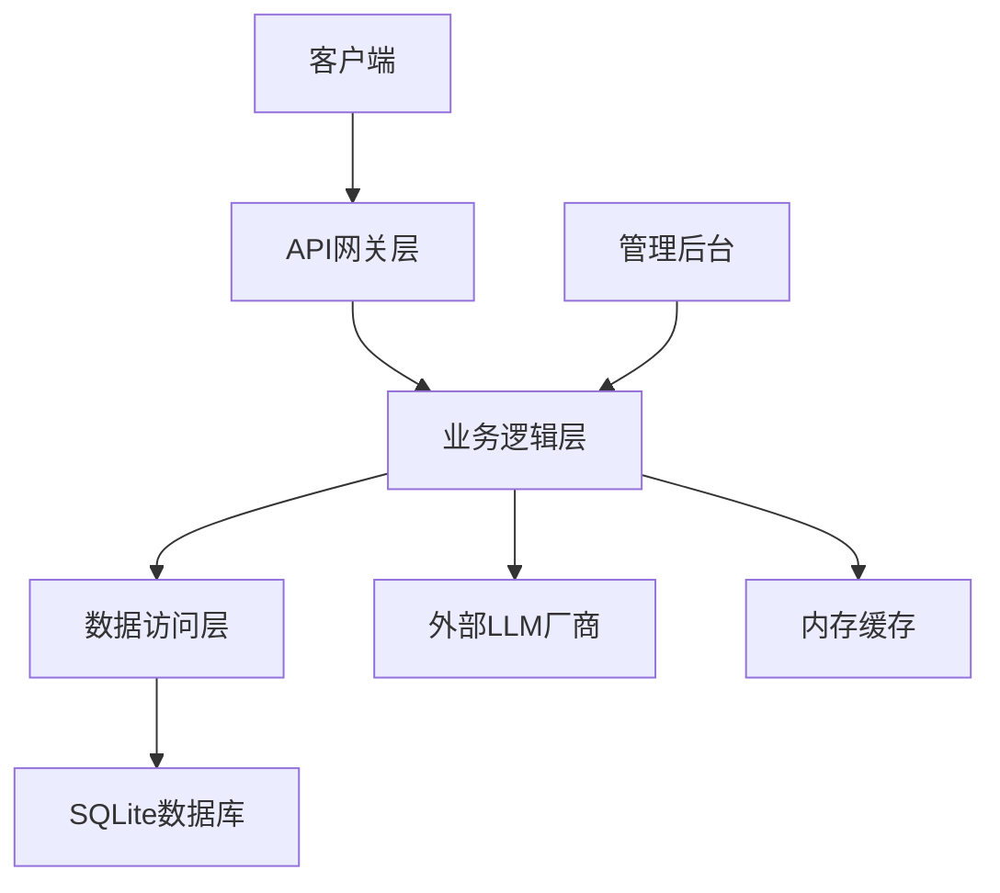
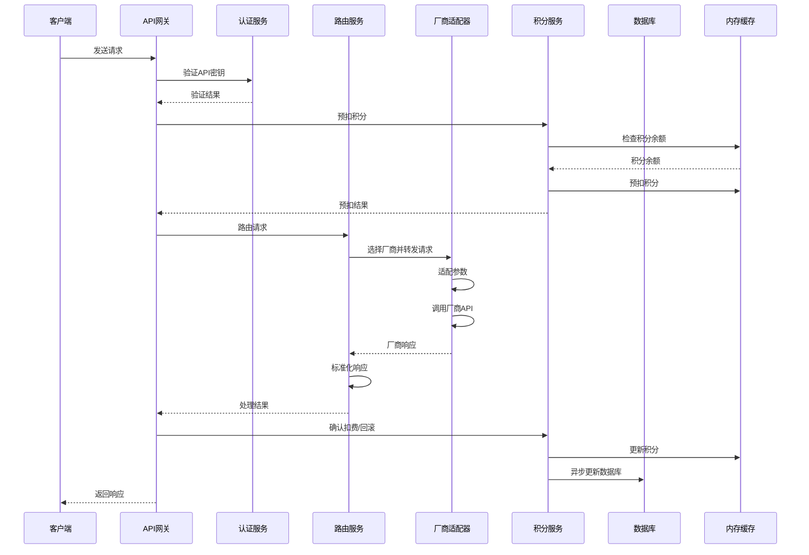
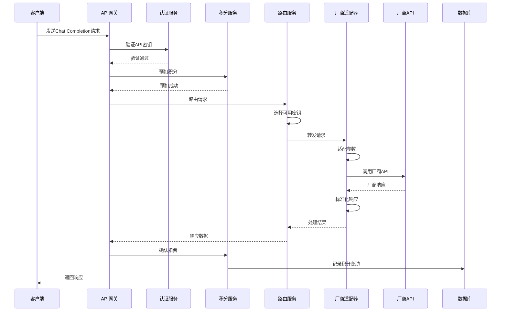
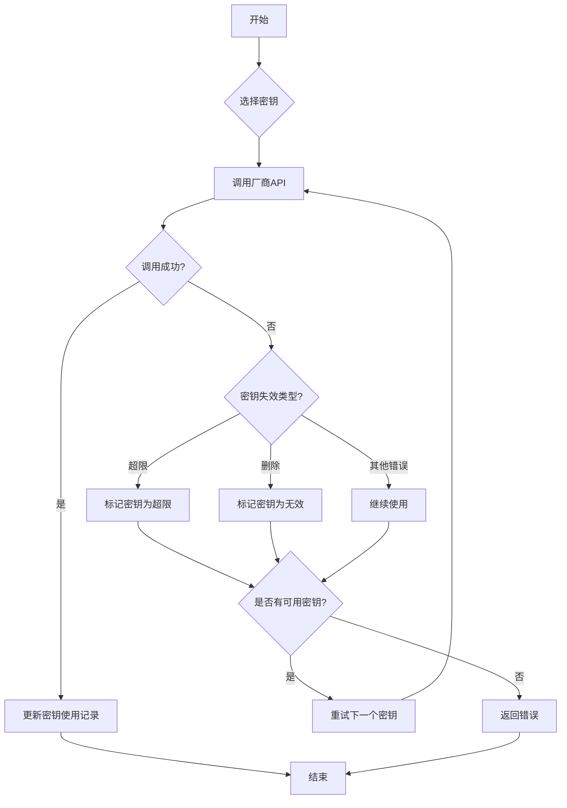
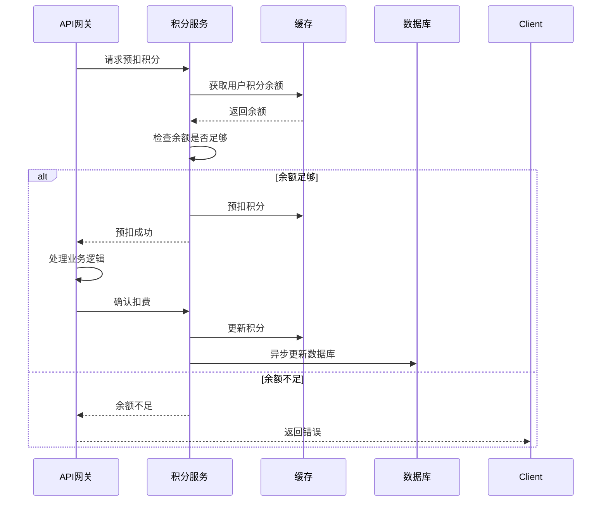

# LLM API聚合计费路由器技术方案

## 1. 技术栈选择

| 类别 | 技术 | 版本 | 选型理由 |
|------|------|------|----------|
| 后端语言 | Python | 3.7+ | 简单易用，生态丰富，适合快速开发API服务 |
| Web框架 | FastAPI | 0.104.1 | 高性能，自动生成API文档，支持异步处理 |
| 数据库 | SQLite | 3.0+ | 轻量级，无需额外服务，适合Demo期使用 |
| 缓存 | 内存缓存 | - | 轻量级，无需额外服务，适合Demo期使用 |
| 认证 | JWT | - | 无状态认证，便于水平扩展 |
| 加密 | cryptography | 41.0.7 | 提供简单的加密功能，用于密钥加密 |
| 测试 | pytest | 7.4.3 | 流行的Python测试框架，支持单元测试和集成测试 |

## 2. 系统架构设计

### 2.1 整体架构



### 2.2 核心模块划分

| 模块 | 职责 | 文件位置 |
|------|------|----------|
| api | API网关，处理HTTP请求 | app/api/ |
| services | 业务逻辑，处理核心功能 | app/services/ |
| models | 数据模型，定义数据库表结构 | app/models/ |
| schemas | 数据验证，定义请求和响应结构 | app/schemas/ |
| providers | 厂商适配器，处理不同厂商的API调用 | app/providers/ |
| utils | 工具函数，提供通用功能 | app/utils/ |
| config | 配置管理，处理系统配置 | app/config/ |
| tests | 测试代码，确保功能正常 | tests/ |

## 3. 核心功能实现

### 3.1 API网关模块

#### 3.1.1 路由设计

##### 3.1.1.1 普通用户接口

| 路径 | 方法 | 功能 | 模块 |
|------|------|------|------|
| /api/v1/auth/login | POST | 用户登录 | api/auth.py |
| /api/v1/users/me | GET | 获取个人信息 | api/users.py |
| /api/v1/keys | POST | 创建API密钥 | api/keys.py |
| /api/v1/keys | GET | 获取密钥列表 | api/keys.py |
| /api/v1/keys/{key_id} | PUT | 更新密钥状态 | api/keys.py |
| /api/v1/keys/{key_id} | DELETE | 删除密钥 | api/keys.py |
| /api/v1/points | GET | 获取积分余额 | api/points.py |
| /api/v1/point-logs | GET | 获取积分明细 | api/points.py |
| /api/v1/chat/completions | POST | 聊天完成接口 | api/chat.py |
| /api/v1/embeddings | POST | 嵌入接口 | api/embeddings.py |

##### 3.1.1.2 后端管理接口

| 路径 | 方法 | 功能 | 模块 |
|------|------|------|------|
| /admin/auth/login | POST | 管理员登录 | api/admin.py |
| /admin/users | GET | 管理用户列表 | api/admin.py |
| /admin/users | POST | 创建用户 | api/admin.py |
| /admin/users/{user_id} | PUT | 更新用户状态 | api/admin.py |
| /admin/users/{user_id} | DELETE | 删除用户 | api/admin.py |
| /admin/points | POST | 调整用户积分 | api/admin.py |
| /admin/keys | GET | 查看所有密钥 | api/admin.py |
| /admin/keys/{key_id} | PUT | 管理密钥状态 | api/admin.py |
| /admin/keys/{key_id} | DELETE | 删除密钥 | api/admin.py |
| /admin/models | GET | 管理模型列表 | api/admin.py |
| /admin/models | POST | 创建模型 | api/admin.py |
| /admin/models/{model_id} | PUT | 更新模型信息 | api/admin.py |
| /admin/models/{model_id} | DELETE | 删除模型 | api/admin.py |
| /admin/logs | GET | 查看调用日志 | api/admin.py |
| /admin/system | GET | 查看系统状态 | api/admin.py |

#### 3.1.2 请求处理流程



### 3.2 业务逻辑模块

#### 3.2.1 认证服务

- 实现JWT令牌生成和验证
- 处理用户登录认证
- 验证API密钥有效性

#### 3.2.2 积分服务

- 管理用户积分余额
- 处理积分预扣和确认
- 实现积分变动记录
- 提供积分余额查询

#### 3.2.3 密钥管理服务

- 生成和管理平台API密钥
- 处理厂商密钥的加密存储和管理
- 实现密钥状态管理和监控

#### 3.2.4 路由服务

- 根据模型参数选择合适的厂商
- 实现轮询策略选择可用密钥
- 处理密钥失效和自动重试

#### 3.2.5 厂商适配服务

- 实现不同厂商API的参数适配
- 处理厂商响应的标准化
- 支持流式响应

### 3.3 数据访问模块

- 实现数据库表结构
- 提供数据CRUD操作
- 实现缓存机制，提高性能

## 4. 数据库设计

### 4.1 表结构

#### 4.1.1 `users` 用户表

| 字段 | 类型 | 说明 |
|------|------|------|
| id | INTEGER | 主键，自增 |
| username | TEXT | 用户名，唯一 |
| email | TEXT | 邮箱，唯一 |
| password_hash | TEXT | 密码哈希 |
| balance | INTEGER | 积分余额，单位：分 |
| status | INTEGER | 状态：0 - 禁用，1 - 正常 |
| created_at | INTEGER | 创建时间戳 |

#### 4.1.2 `api_keys` 密钥表

| 字段 | 类型 | 说明 |
|------|------|------|
| id | INTEGER | 主键，自增 |
| user_id | INTEGER | 所属用户 ID，外键关联 users.id |
| key_type | INTEGER | 密钥类型：1 - 平台调用密钥，2 - 用户托管的厂商密钥 |
| provider | TEXT | 厂商类型（仅厂商密钥有效）：minimax, zhipu, alibaba, tencent, baidu 等 |
| encrypted_key | TEXT | 加密后的密钥内容 |
| name | TEXT | 密钥名称 |
| status | INTEGER | 状态：0 - 正常，1 - 删除， 2 - 禁用，3 - 超限，4 - 无效 |
| used_count | INTEGER | 累计调用次数 |
| last_used_at | INTEGER | 最后使用时间戳 |
| created_at | INTEGER | 创建时间戳 |

#### 4.1.3 `point_logs` 积分明细表

| 字段 | 类型 | 说明 |
|------|------|------|
| id | INTEGER | 主键，自增 |
| user_id | INTEGER | 所属用户 ID |
| amount | INTEGER | 变动数量，正数为增加，负数为扣减 |
| type | INTEGER | 变动类型：1 - 调用消耗，2 - 托管收益，3 - 管理员调整，4 - 平台收入 |
| related_key_id | INTEGER | 关联的密钥 ID |
| model | TEXT | 关联的模型 |
| remark | TEXT | 备注 |
| created_at | INTEGER | 时间戳 |

#### 4.1.4 `call_logs` 调用日志表

| 字段 | 类型 | 说明 |
|------|------|------|
| id | INTEGER | 主键，自增 |
| user_id | INTEGER | 调用用户 ID |
| provider_key_id | INTEGER | 本次使用的厂商密钥 ID |
| model | TEXT | 模型名称 |
| status | INTEGER | 调用状态：0 - 失败，1 - 成功 |
| error_msg | TEXT | 错误信息（失败时） |
| ip | TEXT | 调用者 IP |
| created_at | INTEGER | 时间戳 |

#### 4.1.5 `system_config` 系统配置表

| 字段 | 类型 | 说明 |
|------|------|------|
| key | TEXT | 配置键，主键 |
| value | TEXT | 配置值 |

### 4.2 缓存设计

| 缓存键 | 类型 | 过期时间 | 用途 |
|--------|------|----------|------|
| user:balance:{user_id} | Integer | 1小时 | 缓存用户积分余额 |
| api_key:{key} | String | 1小时 | 缓存API密钥信息 |
| rate_limit:user:{user_id} | Integer | 1分钟 | 用户请求限流计数 |
| rate_limit:key:{key_id} | Integer | 1分钟 | 密钥请求限流计数 |
| available_keys:{provider} | List | 5分钟 | 缓存可用的厂商密钥 |

## 5. 部署与配置

### 5.1 环境要求

- Python 3.7+
- SQLite 3.0+

### 5.2 安装步骤

1. 克隆代码仓库
2. 创建虚拟环境：`python -m venv venv`
3. 激活虚拟环境：`venv\Scripts\activate` (Windows) 或 `source venv/bin/activate` (Linux/Mac)
4. 安装依赖：`pip install -r requirements.txt`
5. 初始化数据库：`python init_db.py`
6. 启动服务：`uvicorn app.main:app --host 0.0.0.0 --port 3000`

### 5.3 配置文件

```yaml
# config.yaml
# 管理员配置
admin:
  password: "admin123" # 管理员密码，首次登录后可修改

# 数据库配置
database:
  driver: "sqlite"
  path: "./data/app.db" # SQLite数据库文件路径

# 限流配置
rate_limit:
  user_rpm: 60 # 单个用户每分钟最大请求数
  default_provider_rpm: 30 # 厂商密钥默认每分钟最大请求数

# 加密配置
security:
  encryption_key: "your-encryption-key" # 用于加密用户厂商密钥的密钥
  jwt_secret: "your-jwt-secret" # 用于登录令牌的密钥

# 超时配置
timeout:
  request_timeout: 5 # 请求超时时间，单位：秒

# 密钥管理配置
key_management:
  max_retry: 1 # 密钥失败后最大重试次数
  cool_down_period: 7200 # 密钥超限时的冷却时间，单位：秒
  max_concurrency: 1 # 每个密钥的最大并发数

# 缓存配置
cache:
  enabled: true
  type: "memory"  # 内存缓存

# 日志配置
logging:
  level: "INFO"
  format: "%(asctime)s - %(name)s - %(levelname)s - %(message)s"
```

## 6. 关键流程设计

### 6.1 模型调用流程



### 6.2 密钥失效处理流程



### 6.3 积分更新流程



## 7. 性能优化策略

1. **缓存优化**：使用内存缓存积分余额和API密钥信息，减少数据库访问
2. **批量更新**：积分更新等高频操作采用批量异步更新，减少数据库写入次数
3. **连接池**：使用数据库连接池，减少连接建立和关闭的开销
4. **异步处理**：使用FastAPI的异步特性，提高并发处理能力
5. **密钥管理**：定期清理无效密钥，优化密钥选择算法

## 8. 安全措施

1. **密钥加密**：厂商API密钥使用加密存储，防止明文泄露
2. **密码哈希**：用户密码使用pbkdf2_sha256哈希存储，不可反向解密
3. **JWT认证**：使用JWT进行API认证，确保接口安全
4. **输入验证**：对所有用户输入进行严格验证，防止注入攻击
5. **日志审计**：记录所有敏感操作的审计日志，便于追溯
6. **HTTPS**：生产环境使用HTTPS加密传输

## 9. 测试计划

### 9.1 单元测试

#### 9.1.1 认证服务测试
- **JWT生成和验证**：测试JWT令牌的生成、验证和过期处理
- **API密钥验证**：测试API密钥的有效性验证
- **密码哈希**：测试密码的哈希存储和验证

#### 9.1.2 积分服务测试
- **积分预扣和确认**：测试积分预扣、成功确认和失败回滚的逻辑
- **积分余额查询**：测试积分余额的实时查询
- **积分变动记录**：测试积分变动的记录和查询

#### 9.1.3 密钥管理服务测试
- **密钥生成**：测试平台API密钥的生成
- **密钥状态管理**：测试密钥的启用、禁用、超限和无效状态管理
- **密钥加密**：测试厂商API密钥的加密存储和解密

#### 9.1.4 路由服务测试
- **请求路由**：测试根据模型参数选择合适的厂商
- **负载均衡**：测试轮询策略选择可用密钥
- **密钥失效处理**：测试密钥失效时的自动重试逻辑

#### 9.1.5 厂商适配器测试
- **参数适配**：测试不同厂商API的参数转换
- **响应标准化**：测试厂商响应的标准化处理
- **流式响应**：测试流式响应的处理

#### 9.1.6 限流服务测试
- **用户限流**：测试用户级别的请求限流
- **密钥限流**：测试密钥级别的请求限流

#### 9.1.7 缓存服务测试
- **积分缓存**：测试积分余额的缓存和更新
- **密钥缓存**：测试API密钥信息的缓存
- **限流缓存**：测试限流计数的缓存

### 9.2 集成测试

#### 9.2.1 模型调用流程测试
- **完整调用流程**：测试从请求接收到响应返回的完整流程
- **异常处理**：测试各种异常情况下的处理逻辑
- **重试机制**：测试密钥失效时的自动重试

#### 9.2.2 积分计费逻辑测试
- **预扣和确认**：测试积分预扣、成功确认和失败回滚
- **收益分配**：测试密钥所有者的积分收益分配
- **平台抽成**：测试平台抽成的计算

#### 9.2.3 密钥失效处理测试
- **超限处理**：测试密钥超限时的状态更新和冷却机制
- **删除处理**：测试密钥被删除时的状态更新
- **重试逻辑**：测试最多重试一次的逻辑

#### 9.2.4 管理后台功能测试
- **用户管理**：测试用户创建、状态管理和积分调整
- **模型管理**：测试模型的创建和定价配置
- **日志查询**：测试调用日志的查询和筛选

### 9.3 性能测试

#### 9.3.1 并发测试
- **不同并发下的响应时间**：测试10、50、100并发下的平均响应时间
- **最大QPS**：测试系统能够处理的最大QPS
- **稳定性测试**：测试系统在持续高并发下的稳定性

#### 9.3.2 缓存性能测试
- **缓存对性能的影响**：测试启用缓存前后的性能对比
- **缓存一致性**：测试缓存与数据库的一致性

#### 9.3.3 数据库性能测试
- **查询性能**：测试高频查询的性能
- **写入性能**：测试批量写入的性能

### 9.4 重点测试内容

#### 9.4.1 核心功能测试
- **API网关转发**：确保所有厂商API的正确转发和响应标准化
- **积分计费**：确保积分的正确预扣、确认和回滚
- **密钥管理**：确保密钥的正确状态管理和失效处理
- **限流控制**：确保系统能够有效防止滥用

#### 9.4.2 边界情况测试
- **积分余额不足**：测试积分余额不足时的处理
- **密钥全部失效**：测试所有密钥都失效时的处理
- **请求超时**：测试厂商API超时的处理
- **并发冲突**：测试并发请求时的处理

#### 9.4.3 安全测试
- **密钥加密**：测试厂商API密钥的加密安全性
- **密码安全**：测试用户密码的哈希安全性
- **API认证**：测试API接口的认证安全性
- **输入验证**：测试用户输入的验证和防止注入攻击

## 10. 代码结构

```
codingPlanShare/
├── app/
│   ├── api/
│   │   ├── __init__.py
│   │   ├── auth.py
│   │   ├── users.py
│   │   ├── keys.py
│   │   ├── points.py
│   │   ├── chat.py
│   │   ├── embeddings.py
│   │   └── admin.py
│   ├── services/
│   │   ├── __init__.py
│   │   ├── auth_service.py
│   │   ├── points_service.py
│   │   ├── key_service.py
│   │   ├── router_service.py
│   │   └── admin_service.py
│   ├── providers/
│   │   ├── __init__.py
│   │   ├── base.py
│   │   ├── minimax.py
│   │   ├── zhipu.py
│   │   ├── alibaba.py
│   │   ├── tencent.py
│   │   └── baidu.py
│   ├── models/
│   │   ├── __init__.py
│   │   ├── user.py
│   │   ├── api_key.py
│   │   ├── point_log.py
│   │   ├── call_log.py
│   │   └── system_config.py
│   ├── schemas/
│   │   ├── __init__.py
│   │   ├── auth.py
│   │   ├── user.py
│   │   ├── key.py
│   │   ├── point.py
│   │   ├── chat.py
│   │   └── admin.py
│   ├── utils/
│   │   ├── __init__.py
│   │   ├── encryption.py
│   │   ├── rate_limit.py
│   │   └── logger.py
│   ├── config/
│   │   ├── __init__.py
│   │   └── settings.py
│   ├── db/
│   │   ├── __init__.py
│   │   └── database.py
│   └── main.py
├── tests/
│   ├── __init__.py
│   ├── test_auth.py
│   ├── test_points.py
│   ├── test_keys.py
│   ├── test_router.py
│   └── test_providers.py
├── data/
│   └── app.db
├── config.yaml
├── requirements.txt
├── init_db.py
└── README.md
```

## 11. 依赖项

```
# requirements.txt
fastapi==0.104.1
uvicorn==0.24.0
sqlalchemy==2.0.48
pydantic==2.12.4
pydantic-settings==2.12.0
python-jose[cryptography]==3.3.0
passlib==1.7.4
cryptography==41.0.7
pytest==7.4.3
httpx==0.25.2
pyyaml==6.0.1
```

## 12. 部署方案

### 12.1 本地部署

1. 安装依赖：`pip install -r requirements.txt`
2. 初始化数据库：`python init_db.py`
3. 启动服务：`uvicorn app.main:app --host 0.0.0.0 --port 3000`

### 12.2 Docker部署

```dockerfile
# Dockerfile
FROM python:3.9-slim

WORKDIR /app

COPY requirements.txt .
RUN pip install --no-cache-dir -r requirements.txt

COPY . .

RUN mkdir -p /app/data

EXPOSE 3000

CMD ["uvicorn", "app.main:app", "--host", "0.0.0.0", "--port", "3000"]
```

构建和运行：
```bash
docker build -t llm-gateway .
docker run -d -p 3000:3000 -v ./data:/app/data llm-gateway
```

## 13. 监控与维护

1. **日志监控**：使用结构化日志，便于分析和排查问题
2. **健康检查**：提供健康检查接口，监控系统状态
3. **告警机制**：当系统出现异常时，及时发送告警
4. **定期备份**：定期备份数据库，防止数据丢失
5. **性能监控**：监控系统的响应时间和QPS，及时发现性能问题

## 14. 总结

本技术方案基于FastAPI和SQLite，实现了一个轻量级的LLM API聚合计费路由器，支持多厂商API适配、积分计费、密钥管理和自动重试等核心功能。方案采用模块化设计，便于后续扩展和维护，同时通过缓存和异步处理等技术优化性能，满足Demo期的使用需求。

通过本方案的实施，可以快速构建一个功能完整、性能可靠的LLM API聚合服务，为开发者提供统一的接口和低成本的模型调用服务。